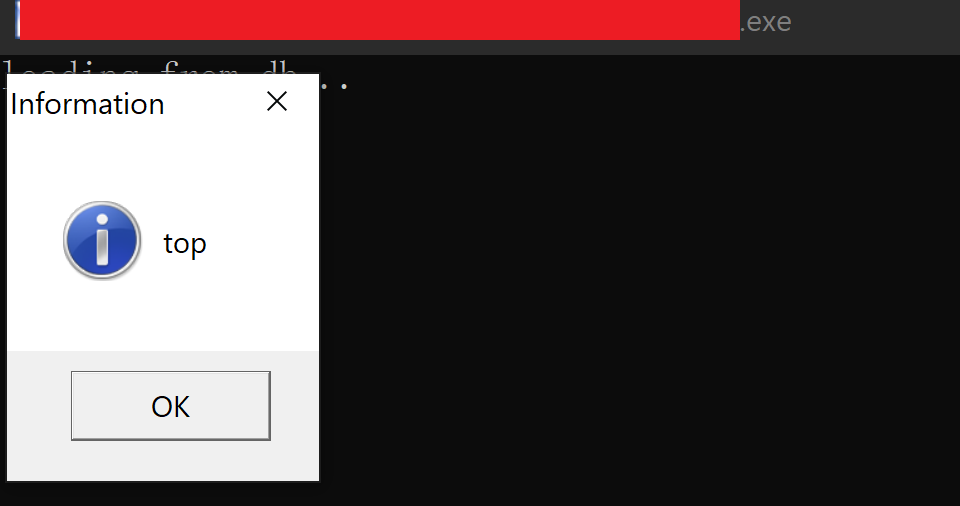

# KrkrExtract
A tool can extract and pack krkr2 and krkrz's xp3 files (32Bit & 64Bit)  

### Beta Version Warning!!

* download pre-release binaries from release page
* DO NOT USE v5 now

## 中文说明
* 我平时很忙，本工程开源并且可以编译，遇到问题应该先自己解决，然后提交PR。
* wiki还在建设中，不知道什么时候能完成。
* 受保护的程序一律不支持，支持就是打开潘多拉魔盒，你得保证各类bypass不冲突。
* krkr2打包请直接使用UI上的封包功能
* krkrz打包请直接使用Universal Patch功能
* 转发本工具请附上本README

## Universal Dumper!!
* Only valid for `krkrz` target
* Just click `!!Dump!!` and wait
* warning!! : may extremely slow on low performance platform
* warning!! : may run out of memory on low performance platform

## New Universal Patch
* Using KrkrExtract to automatically generate `KrkrExtract.db`
* Copy `KrkrExtract.db` to your game dir
* `Universal Patch` will read info from `KrkrExtract.db` firstly
* now, `Universal Patch` is able to override top level script!  

## Build
* vs2017
* Win10 SDK (10.0.17763.0)
* Only `Release` build is supported

## Improvement & New feature
* PRs are welcomed. Since I'm very busy with my work, I almostly have no time to develop this project.
* KrkrExtract will NEVER support custom kirikiri version (if it's not widely used)
* Make sure executable binaries are not being protected

## Bug report
* screenshot (stack trace, ...)
* BUT please strip game information from your screenshots

## The Next Generation of KrkrExtract
[KrkrzExtract Website](https://github.com/xmoeproject/KrkrzExtract)

## OpenSource License  

All source code files are licensed under [GNU General Public License v3 (GPLv3)](https://www.gnu.org/licenses/quick-guide-gplv3.en.html).  

## Note
Since I have no time on this project, KrkrExtract will only focus on xp3-like archive unpack.  
KrkrExtract will not foucs on modified krkr engines.  
If you have any needs, pls develop by yourself.  

## Encrypted(protected) executable file
Actually, If I add some bypass supports in this project, It's very difficult to support make sure they will not conflict with other parts.  
So you're sure that the executable file is protected, pls remove the protection or just patch the binary and then use KrkrExtract to unpack archives.

## Separated tools
I provide many separated tools to you.  
If krkrExtract is not able to process some files corrently, you should try seperated tools first.

## More English docs?
I'm trying to do this.  
Since I almostly have no time on open source project, I'm not sure when can I upload more docs about my tools.

## Any differences between krkr2 and krkrz?
My answer is NO DIFFERECES.  
krkrz supports msvc while krkr2 can only built by bcb.  
Some companies modified krkrz so we need more steps to unpack archives.  

## Why universal patch not compatible with krkr2?  
krkr2 use bcb(C++ Builder, legency version...) as default compiler.   
bcb will make code more complex so sometimes it's more difficult to analyze code automatically, plus, KrkrExtract can pack archives for krkr2.  

## How to use & How to ...  
I know maybe have many questions about KrkrExtract, Pls see the website below firstly.  
[KrkrExtract Website](https://xmoeproject.github.io/KrkrExtract/)

## Any problem about repack?  
Why not try to use universal patch?  

## Other krkr Project  
AlphaMovie Decoder:  
[AlphaMovie Decoder Project](https://github.com/xmoeproject/AlphaMovieDecoder)

## 64Bit Version 
useless:)  
I've removed all source codes about 64bit version.  
I don't think any company will use 64bit version.  

## Website
[KrkrExtract Website](https://xmoeproject.github.io/KrkrExtract/)

## Special Thanks
感谢amemiya帮我纠正英文错误，丢人现眼了。  

